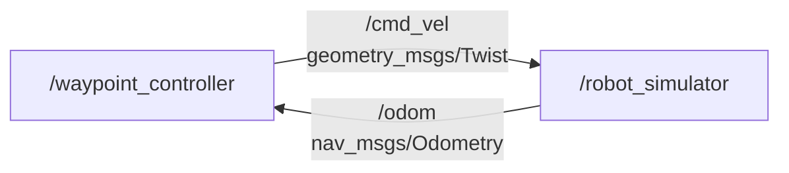
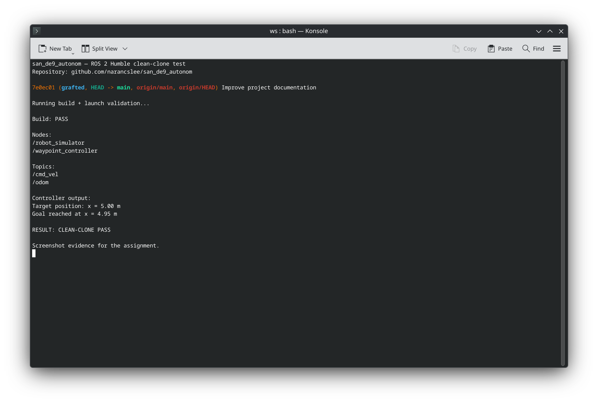

# san_de9_autonom

ROS 2 Humble Python package demonstrating a simple autonomous waypoint controller for a simulated robot moving along the x axis.

The package contains two nodes:

- `robot_simulator`: simulates the robot motion.
- `waypoint_controller`: uses odometry feedback to drive the robot toward a target position.

The default target position is `x = 5.0 m`.

## Node-topic graph



## ROS topics

### `robot_simulator`

Subscribes to:

- `/cmd_vel` (`geometry_msgs/Twist`)

Publishes:

- `/odom` (`nav_msgs/Odometry`)

### `waypoint_controller`

Subscribes to:

- `/odom` (`nav_msgs/Odometry`)

Publishes:

- `/cmd_vel` (`geometry_msgs/Twist`)

The two nodes form a closed feedback loop: the controller reads the simulated position from `/odom` and sends a velocity command on `/cmd_vel`.

## Controller

The waypoint controller uses proportional control:

- proportional gain: `KP = 0.8`
- maximum speed: `1.0 m/s`
- goal tolerance: `0.05 m`
- target parameter: `goal_x`
- default target: `5.0 m`

When the robot reaches the goal tolerance, the commanded velocity is set to zero.

## Clone

The following example assumes a ROS 2 workspace at `~/ros2_ws`.

```bash
mkdir -p ~/ros2_ws/src
cd ~/ros2_ws/src
git clone https://github.com/narancslee/san_de9_autonom.git
```

## Build

```bash
cd ~/ros2_ws
source /opt/ros/humble/setup.bash
colcon build --packages-select san_de9_autonom --symlink-install
source install/setup.bash
```

## Run

```bash
ros2 launch san_de9_autonom autonomous_demo.launch.py
```

A successful run starts both nodes and the controller drives the simulated robot toward the target.

Example output:

```text
Target position: x = 5.00 m
Goal reached at x = 4.95 m
```

## Check the ROS graph

While the launch file is running, the nodes and topics can be checked with:

```bash
ros2 node list
ros2 topic list
```

The expected nodes include:

```text
/robot_simulator
/waypoint_controller
```

The expected topics include:

```text
/cmd_vel
/odom
```

## Example run

The following screenshot shows a successful ROS 2 Humble clean-clone build and launch validation.


